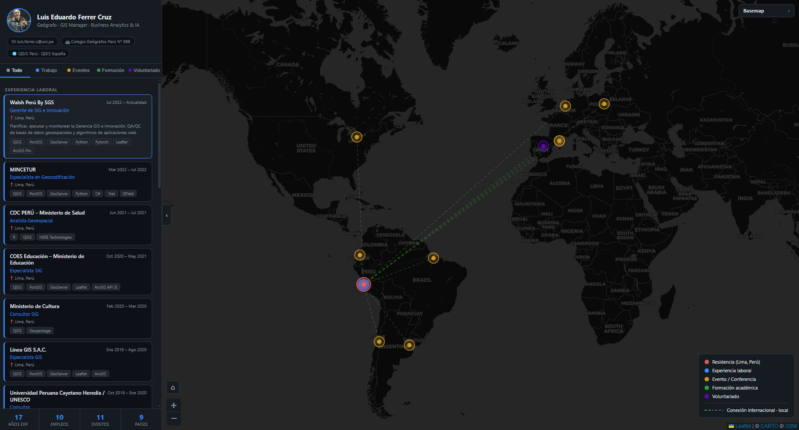

# GeoCV — Luis Eduardo Ferrer Cruz

Currículum vitae interactivo basado en un mapa web. Cada experiencia laboral, evento, formación académica y actividad de voluntariado queda georreferenciada y explorable a través de un mapa Leaflet con líneas de conexión animadas desde Lima, Perú.

🔗 **Demo:** [GeoCV Lucho](https://lefcgis.github.io/geocv_lefcgis/)

---

## Vista general

El proyecto combina un panel lateral filtrable con un mapa interactivo: al seleccionar una tarjeta, el mapa hace zoom al lugar correspondiente; al cambiar de categoría, los marcadores y las líneas de conexión se actualizan en tiempo real.



---

## Características

- **Mapa Leaflet** con marcadores SVG personalizados por categoría
- **Líneas de conexión animadas** Lima → todas las ubicaciones, con colores diferenciados por distancia (internacional / local) y adaptados al basemap activo
- **5 basemaps intercambiables**: OSM Standard, Google Satélite, Google Maps, Bing Aerial y CartoDB Dark (predeterminado)
- **Panel lateral filtrable** por categoría: Trabajo, Eventos, Formación y Voluntariado
- **Tarjetas colapsables** con descripción, herramientas y enlace institucional en el rol
- **Botón Home** para volver a la vista inicial desde cualquier zoom
- **Lightbox** al hacer clic en la foto de perfil
- **Modo oscuro** completo mediante variables CSS personalizadas
- Panel de basemaps y leyenda integrados en el mapa

---

## Categorías

| Categoría | Color | Descripción |
|-----------|-------|-------------|
| Trabajo | `#388bfd` | Experiencia laboral profesional |
| Eventos | `#d29922` | Conferencias, workshops y ponencias |
| Formación | `#2ea043` | Educación universitaria y de postgrado |
| Voluntariado | `#5e07b5` | Participación en asociaciones y comunidades |

---

## Tecnologías

| Capa | Tecnología |
|------|-----------|
| Mapa | [Leaflet 1.9.4](https://leafletjs.com/) |
| Estilos | CSS puro con custom properties (tema oscuro) |
| Lógica | Vanilla JavaScript (sin frameworks) |
| Datos | GeoJSON generado con Python (stdlib) |
| Tiles | CartoDB Dark Matter / OSM / Google / Bing |

---

## Estructura del proyecto

```
c2/
├── index.html            # Shell HTML
├── css/
│   └── style.css         # Tema oscuro y layout
├── js/
│   └── app.js            # Toda la lógica del mapa y la UI
├── data/
│   ├── locations.js      # Fuente de datos del CV (cvData global)
│   ├── locations.geojson # Puntos generados por Python
│   ├── connections.geojson
│   ├── summary.json
│   └── lefc.jpg          # Foto de perfil
└── generate_data.py      # Genera los GeoJSON desde locations.js
```

---

## Uso local

No requiere servidor ni dependencias. Basta con abrir `index.html` en el navegador:

```bash
# Windows
start index.html

# O simplemente doble clic en index.html
```

Para regenerar los archivos GeoJSON tras editar `data/locations.js`:

```bash
python generate_data.py
```

Solo usa la biblioteca estándar de Python (sin `pip install`).

---

## Datos del problema de doble fuente

Los datos del CV viven en dos lugares que deben mantenerse sincronizados manualmente:

- `data/locations.js` → leído por el navegador
- `generate_data.py` → fuente para los GeoJSON

Al añadir o editar un registro, actualizar **ambos** archivos.

---

## Licencia

Este proyecto se distribuye bajo la licencia **GNU General Public License v3.0**.  
Ver el archivo [LICENSE](LICENSE) para más detalles.

---

## Autor

**Luis Eduardo Ferrer Cruz**  
Geógrafo · GIS Manager · Business Analytics & IA  
[linkedin.com/in/luchofgis](https://www.linkedin.com/in/luchofgis) · [luis.ferrer.c@uni.pe](mailto:luis.ferrer.c@uni.pe)  
Colegio de Geógrafos del Perú N° 666
